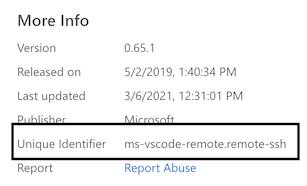

# VH Data Ingestion Extension Pack

## Overview

This extension pack contains the following VS Code Extensions:

|Extension|Description|
|--|--|
|Pylance|A utility for python autocompletion|
|GitHub|Great for working in VS Code such as Pull Requests|
|Code Spell Checker|Helpful for catching typos|
|Docker|Docker in VS Code|
|Go|Go in VS Code|
|Remote - SSH|Great for working with remote servers|
|Remote - Containers|Great for working with docker containers|
|Markdown All in One|Helps streamline writing markdown|
|markdownlint|Extension that supports better markdown writing|
|Jira and Bitbucket (Official)|Ties into Atlassian and helpful for streamlining development workflow|

## Usage

1. To use this extension pack, you will need to open up VS Code and select to drop down to `Install from VSIX...`
   1. 
2. Once installed, you can uninstall and disable the extension pack from within VS Code.

## Contribution

### Set up

1. Will need to install npm, see here [https://nodejs.org/en/](https://nodejs.org/en/)
2. Then need to install the `vsce` utility.  See here for instructions [https://code.visualstudio.com/api/working-with-extensions/publishing-extension](https://code.visualstudio.com/api/working-with-extensions/publishing-extension)

### Add Extensions

1. Feel free to add packages to this Extension Pack.  You can do this by going to an extensions site and looking at the right pane for More Info for the Unique Identifier.
   1. 
2. Once you have that, you can add it to the [package.json](package.json) file in the `extensionPack` section.
3. Once added, you can then run the following to regenerate the vsix file:

       vsce package

4. Once run, push up to GitHub.
